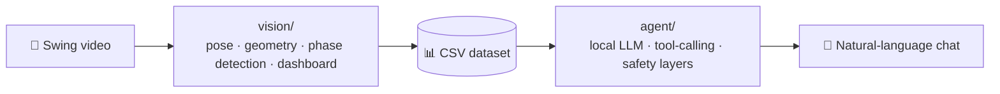
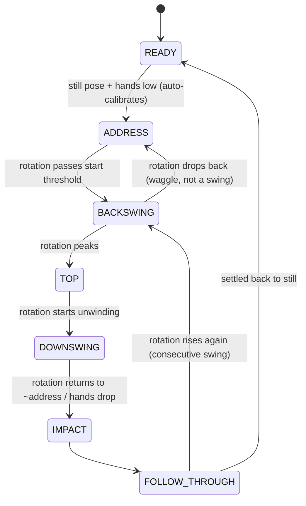
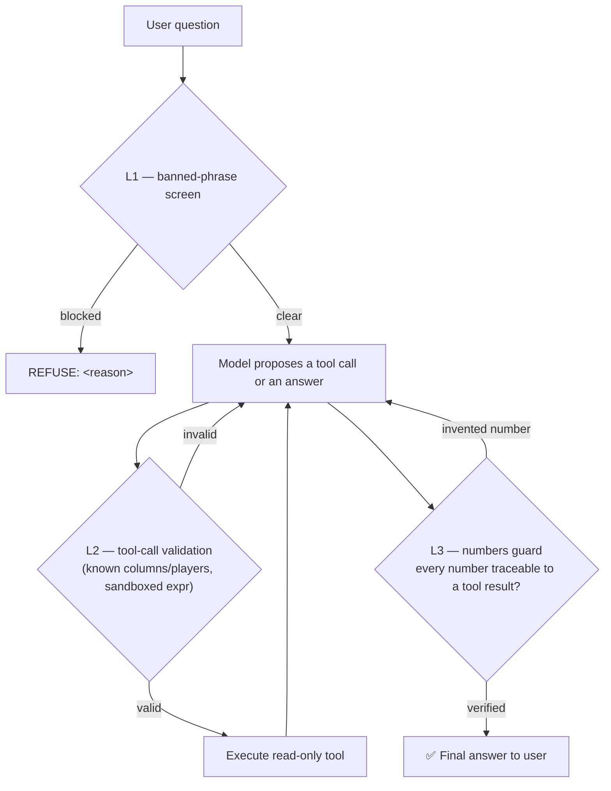

<div align="center">

# 🏌️ Golf Swing Analyzer

**Computer-vision swing biomechanics — plus a local LLM that can talk about the data.**

No wearables. No motion-capture suit. No cloud API calls for the analysis.
Just a single camera angle, MediaPipe pose estimation, and a locally-hosted
model that answers questions about what it found.


-8A2BE2)


</div>

---

## Table of contents

- [Why this project](#why-this-project)
- [Architecture](#architecture)
- [Features](#features)
- [How the swing detector works](#how-the-swing-detector-works)
- [How the agent stays honest](#how-the-agent-stays-honest)
- [Project structure](#project-structure)
- [Installation](#installation)
- [Usage](#usage)
- [Dataset schema](#dataset-schema)
- [Troubleshooting](#troubleshooting)
- [Roadmap](#roadmap)
- [Requirements](#requirements)
- [Contributing](#contributing)
- [Acknowledgments](#acknowledgments)
- [License](#license)

---

## Why this project

Swing analysis usually means one of two things: an expensive wearable/launch-monitor
setup, or a coach eyeballing a slow-motion replay. This project takes a third path —
**pure computer vision on a single camera angle**, turning a phone video into real
biomechanics numbers (joint angles, rotation, tempo) with no hardware beyond the
camera you already have.

The second half — the agent — exists because raw CSV rows aren't useful to a
golfer. Instead of shipping the data to a cloud API, the whole analyst runs
**locally**: no per-query cost, no video or swing data leaving the machine, and
a model that is architecturally *prevented* from inventing a statistic — every
number it says has to come from a tool call against the real file, not from
"sounding right" (see [How the agent stays honest](#how-the-agent-stays-honest)).

> 📸 *This is the single highest-impact addition you can make to this README:
> a screenshot or short GIF of the annotated video with the live dashboard
> next to it. Drop it right here once you have one.*

---

## Architecture



The two halves are **fully independent**. `vision/` never imports anything
from `agent/`, and `agent/` never touches OpenCV/MediaPipe — the CSV file is
the entire handoff. You can run swing analysis on a laptop with no GPU at
all, and you can develop or test the agent against any CSV matching the
schema below, without a camera or a video in sight.

---

## Features

### `vision/` — swing analysis
- **Pose extraction** — 33-point body pose via MediaPipe Pose Landmarker, in
  both pixel space and real-world meters.
- **Colored skeleton overlay** — lead leg/arm, trail leg/arm, and spine drawn
  distinctly on the video.
- **Joint-angle geometry engine** — spine tilt, knee flexion (both legs),
  elbow flexion (both arms) from plain vector math, with **every metric
  gated on landmark visibility** — a low-confidence joint reports `None`
  instead of a guessed number.
- **Rotation & X-Factor engine** — hip rotation, shoulder rotation, and their
  separation (X-Factor), computed from world-space coordinates so it holds
  up even though the camera only sees 2D.
- **Swing-phase state machine** — see the diagram below — driven by rotation
  velocity and hand height, with:
  - automatic address-position calibration (no manual setup step)
  - waggle cancellation (a practice waggle doesn't get counted as a swing)
  - scene-cut detection (a replay/angle change doesn't get parsed as a swing)
  - per-phase timeouts so a stuck detector always self-resets
  - swing numbering that survives a body-tracking dropout mid-video
- **Quality scoring** — each metric at TOP / IMPACT / FOLLOW_THROUGH is
  classified against literature-based **PRO** / **AMATEUR** / **OUT** ranges,
  rolled up into a per-swing `quality_score_pct` (plus a
  `quality_confidence_pct` that tells you how many metrics that score is
  actually based on — a 100% score from 2 measured metrics isn't the same
  claim as 100% from 12).
- **Live dashboard overlay** — phase indicator + labeled, colored bars for
  every metric, composited next to the video frame.
- **Dataset export** — one CSV per video, plus a de-duplicated master CSV
  across every video/player you've analyzed, with a `*_class` (PRO/AMATEUR/OUT)
  column alongside every metric, tempo computed from raw frame counts (not
  rounded seconds), and a comparison plot (`.png`) across a video's swings.

### `agent/` — the "Golf Swing Analyst"
- **Local LLM, tool-calling only** — Qwen3-4B-Instruct (4-bit quantized) is
  never allowed to state a number it didn't get from a tool call; it can
  only *read* the dataset through four whitelisted, read-only tools
  (`query_stats`, `compare`, `get_catalog`, `get_table`).
- **Sandboxed expression language** — `query_stats` accepts small expressions
  like `slope(top_x_factor_deg)` or `last(quality_score_pct) - first(...)`,
  validated with a deny-by-default AST walk (not `eval`) before anything
  runs: unknown functions, unknown columns, and anything resembling code
  execution are rejected before the model's request ever touches the data.
- **Three-layer safety pipeline** — request screen → tool-call validation →
  numbers guard (full diagram below).
- **Bilingual by design** — the request screen and scope detection run in
  **Arabic and English** in parallel, since that's how the intended users
  actually write.
- **Conversation memory** — short per-player notes persisted to
  `agent_memory.json` across sessions (used only as a *hint*; the model
  still has to verify every number via a tool call every time), plus
  same-session context for short follow-up replies (a player's name typed
  alone after the agent asks "which player?").
- **Graceful degradation** — a hard per-question attempt budget with a
  fallback: if the model can't land a clean final answer in time, the agent
  summarizes whatever real tool results it already collected instead of
  just failing outright.
- **13-scenario compliance suite** (`scripts/run_agent_tests.py`) covering
  scope detection, tool use, refusals, and clarification requests, in both
  languages.

---

## How the swing detector works

No ML here — a deliberately transparent state machine, so every transition
is explainable:



Every phase also has a frame-count timeout, so a bad detection in one phase
can never permanently strand the machine — it always self-resets to `READY`.

---

## How the agent stays honest



If the model exhausts its attempt budget without a clean pass through L3,
the agent falls back to a plain summary built directly from the real tool
results already collected — it never just gives up with nothing.

---

## Project structure

```
golf-swing-analyzer/
├── vision/                    # computer-vision pipeline (no agent code, no LLM deps)
│   ├── config.py              #   every CV constant in one place
│   ├── model_loader.py        #   downloads/caches the MediaPipe pose model
│   ├── pose.py                #   Part 1 — pose landmark extraction
│   ├── skeleton.py            #   Part 2 — skeleton overlay drawing
│   ├── geometry.py            #   Part 3 — joint-angle math
│   ├── rotation.py            #   Part 4 — hip/shoulder rotation, X-Factor
│   ├── phase_detector.py      #   Part 5 — swing-phase state machine
│   ├── quality.py             #   Part 5A — PRO/AMATEUR quality standards
│   ├── export.py              #   Part 5B — CSV dataset export + plots
│   ├── dashboard.py           #   Part 6 — live dashboard overlay
│   └── pipeline.py            #   Part 7 — main video-processing loop
│
├── agent/                     # the LLM analyst (no OpenCV/MediaPipe deps)
│   ├── config.py               #   model settings + the system prompt template
│   ├── llm.py                  #   local model backend (load + generate)
│   ├── data_loader.py          #   loads the CSV, builds the injected prompt
│   ├── security.py             #   L1/L2/L3 safety layers
│   ├── tools.py                #   the 4 whitelisted read-only data tools
│   ├── memory.py                #   durable + session conversation memory
│   ├── engine.py                #   GolfSwingAgent — the main ask() loop
│   ├── chat.py                  #   interactive terminal chat loop
│   └── tests.py                 #   13-scenario compliance suite
│
├── scripts/
│   ├── analyze_video.py        # CLI: video → annotated video + CSV dataset
│   ├── run_agent_chat.py       # CLI: start an interactive chat session
│   └── run_agent_tests.py      # CLI: run the compliance suite
│
├── tests/                      # fast, GPU-free unit tests (pytest)
│   ├── test_vision_geometry.py #   angle/rotation math
│   └── test_agent_security.py  #   security layer + tool execution
│
├── requirements.txt             # vision/ dependencies
├── requirements-agent.txt       # + agent/ dependencies (torch, transformers...)
├── requirements-dev.txt         # + pytest
└── pytest.ini
```

---

## Installation

```bash
git clone <your-repo-url>
cd golf-swing-analyzer
python -m venv .venv && source .venv/bin/activate   # Windows: .venv\Scripts\activate

pip install -r requirements.txt          # vision/ only
pip install -r requirements-agent.txt    # + the agent (a GPU is strongly recommended)
pip install -r requirements-dev.txt      # + to run the test suite
```

The MediaPipe pose model is **not** bundled in the repo — `scripts/analyze_video.py`
downloads and caches it on first run.

---

## Usage

### 1. Analyze a swing video

```bash
python scripts/analyze_video.py path/to/swing.mp4

# with options
python scripts/analyze_video.py path/to/swing.mp4 \
    --player ahmed \
    --output ahmed_annotated.mp4 \
    --model-variant full \
    --actual-swings 11        # optional: prints detection accuracy vs. ground truth
```

This writes:
- an annotated video with the skeleton overlay + live dashboard side by side
- `swing_data/swings_<player>.csv` — this video's swings
- `swing_data/all_swings_dataset.csv` — the accumulating master dataset (what the agent reads)
- `swing_data/comparison_<player>.png` — a comparison plot across the video's swings

Run it again for more players/videos — the master CSV accumulates, replacing
only that player's rows each time you re-analyze their video.

### 2. Chat with the analyst

```bash
python scripts/run_agent_chat.py
```

```
you: متوسط لفة الكتف عند القمة لـ ahmed كام؟
agent (2.1s | attempts: 2): متوسط لفة الكتف عند القمة لـ ahmed هو 92.4 درجة — ضمن نطاق المحترفين (85-110).

you: what's his tempo trend across the swings?
agent (1.8s | attempts: 2): Tempo is trending up slightly (slope +0.03/swing) toward the pro range of 2.5-3.5:1 — steady rhythm, no red flags.
```

Same conversation, two languages, zero setup — that's the bilingual request
screen at work, not a translation layer bolted on top.

### 3. Run the compliance suite

```bash
python scripts/run_agent_tests.py
```

### 4. Run the unit tests (no GPU, no dataset needed)

```bash
python -m pytest
```

---

## Dataset schema

One row per swing in `swing_data/all_swings_dataset.csv`:

| Column | Meaning |
|---|---|
| `player`, `video`, `swing_id`, `swing_uid` | identity (`swing_uid` = e.g. `ahmed#3`) |
| `start_s` / `top_s` / `down_s` / `impact_s` / `end_s` | phase timestamps (seconds) |
| `backswing_time_s`, `downswing_time_s`, `tempo_ratio` | timing (pro tempo ≈ 2.5–3.5:1) |
| `top_shoulder_rotation_deg`, `top_hip_rotation_deg`, `top_x_factor_deg`, `top_spine_tilt_deg`, `top_lead_knee_flexion_deg`, `top_trail_knee_flexion_deg` | metrics at the top of the backswing |
| `impact_hip_rotation_deg`, `impact_spine_tilt_deg`, `impact_lead_knee_flexion_deg`, `impact_lead_elbow_flexion_deg` | metrics at impact |
| `follow_shoulder_rotation_deg`, `follow_hip_rotation_deg` | metrics at the finish |
| `*_class` (one per metric above) | `PRO` / `AMATEUR` / `OUT` |
| `quality_score_pct` | % of measured metrics that landed in the PRO range |
| `quality_confidence_pct` | % of all *possible* metrics that were actually measured this swing (low value = take the score with a grain of salt — a joint was occluded a lot) |
| `shallow_top_flag` | `True` if the backswing barely cleared the TOP threshold |

Rotation angle **sign** is an axis convention, not a quality signal — the
agent's system prompt explicitly teaches it to read magnitude against the
pro range and describe the physical meaning (e.g. "coiled 90° at the top"),
not to treat a negative follow-through value as a decline.

---

## Troubleshooting

| Symptom | Cause | Fix |
|---|---|---|
| `python: can't open file '...\venv\Scripts\activate'` | Ran `activate` through `python`, and/or the venv folder is `.venv` (with a dot), not `venv` | Run `.venv\Scripts\activate` directly — no `python` prefix. Type `.venv\S` and press **Tab** to auto-complete and avoid typos. |
| `no such option: -m` after `pip install ...` | Two commands were typed on one line | Each command goes on its own line, its own Enter. |
| `ModuleNotFoundError: No module named 'torch'` | `requirements-agent.txt` was never installed | `pip install -r requirements-agent.txt` — it's separate from `requirements.txt` on purpose, so `vision/` never needs a GPU stack. |
| Video path "not found" on Windows | Manually-typed path is missing a `\` or the username/folder | Drag the video file from Explorer straight into the CMD window after typing the opening `"` — Windows fills in the full correct path for you. |
| Agent replies take minutes, not seconds | No CUDA GPU detected — Qwen3-4B fell back to CPU | Expected, not a bug. A GPU with ~6 GB+ VRAM is what the sub-2-second replies above assume. |
| `bitsandbytes` fails to install on Windows | Its Windows wheel support is inconsistent outside WSL | Run the agent under WSL2, or on Linux/macOS, if a native Windows install fails. |

---

## Roadmap

Ideas for where this could go next — not commitments, just the natural next steps:

- [ ] Multi-camera / down-the-line + face-on fusion for angles a single camera can't see well
- [ ] A lightweight web UI over `agent/` instead of a terminal chat
- [ ] Swing-to-swing video clip auto-extraction (cut each detected swing into its own file)
- [ ] Extending the quality-standard reference ranges with a larger, sourced dataset
- [ ] Packaging `vision/` and `agent/` as installable PyPI packages

---

## Requirements

- Python 3.10+
- `vision/`: CPU is fine; a GPU speeds up MediaPipe but isn't required.
- `agent/`: a CUDA GPU with ~6 GB+ VRAM is strongly recommended for the
  4-bit Qwen3-4B model. It will run on CPU, but replies take minutes instead
  of seconds.

---

## Contributing

Issues and pull requests are welcome. Before opening a PR:
1. Run `python -m pytest` — the GPU-free suite must pass.
2. Keep the `vision/` ↔ `agent/` boundary intact — neither package should
   import from the other.
3. New tool calls in `agent/tools.py` need a matching entry in
   `agent/security.py`'s validation — the two are required to agree.

## Acknowledgments

- [MediaPipe](https://developers.google.com/mediapipe) (Google) — pose landmark detection
- [Qwen3](https://github.com/QwenLM/Qwen) (Alibaba/Qwen team) — the local LLM backing the agent
- OpenCV, pandas, NumPy, Matplotlib, Hugging Face Transformers

## License

No license file is included yet — until one is added, all rights are
reserved by default and others can't legally reuse this code.
able to use and build on it freely. Happy to generate a `LICENSE` file for
you — just say the word (and which license you'd prefer, if not MIT).
